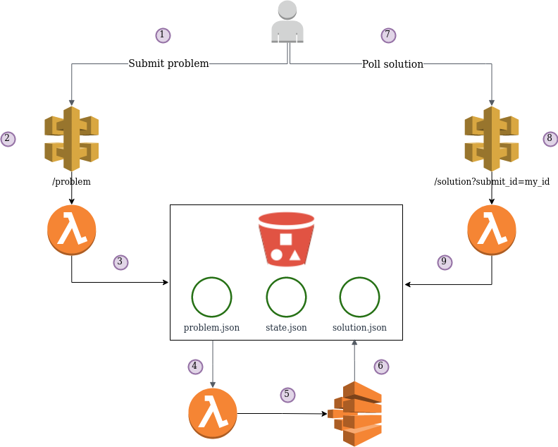

# Description

The intention of this project is to build a skeleton of VRP REST API for quick prototyping using Rust and AWS. It uses
another Rust project which implements a rich VRP solver functionality, you can find it [here](https://github.com/reinterpretcat/vrp).

# Overview

## Architecture

On API level, there are two public endpoints:

- __submit problem__: responsible for submitting VRP in [pragmatic format](https://reinterpretcat.github.io/vrp/concepts/pragmatic/index.html)
- __poll solution__: provides way to get calculated VRP solution back

Essentially, the flow can be described as follows:



1. User create POST request to `/problem` resource which is exposed via AWS API Gateway.
2. API Gateway triggers AWS `submit_problem` lambda function. See its source code inside `./lambdas/gateway/submit` folder.
3. If problem definition is ok, the lambda function uploads it to S3 bucket as `problem.json`. As result, user gets
`submit id` which is the name of the bucket.
4. The `trigger_solver` lambda function is triggered once `problem.json` is uploaded. Its source code is inside
`./lambdas/triggers/batch` folder.
5. This lambda triggers a AWS Batch job for solving VRP.
6. The Batch job pulls problem definition from S3 bucket, solves VRP, and uploads `solution.json`
7. Any time user can poll solution by calling `/solution` resource using GET method. This resource is also exposed
via AWS API Gateway.
8. API Gateway triggers AWS `poll_problem` lambda function. See its source code inside `./lambdas/gateway/poll` folder.
9. The lambda function downloads `state.json` file (see a note below) and, depending on its content, returns solution
or submission state.

Notes:
- additionally, there is `state.json` file in S3 bucket. It is used to track the state of submission and, potentially,
return some information regarding execution progress
- actually, batch job can be created by submit lambda, but this would limit extensibility: in real world, there
should be an extra step to request routing matrix information. It might be expensive in terms of performance and time,
so another logic might be needed here and it is better to avoid coupling problem submission and calling the solver.


## Source code structure

- __Rust code__:
    - `./common`: contains shared code used by different crates in the project
    - `./lambdas`: contains code for AWS lambda functions
    - `./solver`: contains a binary crate for solving VRP problem
- __Build & Deployment & Test__
    - `./terraform`: terraform configuration to deploy AWS resources
    -  `./scripts`: various scripts to build, deploy, and test (see next section for details)
    - `./solver/image/Dockerfile`: a docker file for solver image

# How to use

## Prerequisites

Once source code is pulled from github, make sure that you have the following prerequisites:

- linux compatible environment
- rust
    * install rust toolchain using instructions from [official site](https://www.rust-lang.org/tools/install)
    * install cross compilation tool from [github](https://github.com/rust-embedded/cross) which will be used to build
      code to be in AWS:
      ```shell script
      # see https://github.com/awslabs/aws-lambda-rust-runtime/issues/17
      cargo install --force --git https://github.com/rust-embedded/cross
      ```
- AWS
    * create an account in [AWS](https://aws.amazon.com/resources/create-account)
    * create Elastic Container Repository with `vrp-solver` name which will be used to publish docker image
    * set environment variables:
    ```shell script
    export AWS_ACCESS_KEY_ID=your-access-key
    export AWS_SECRET_ACCESS_KEY=your-secret-key
    export AWS_DEFAULT_REGION="eu-west-1" # or another one
    ```
- Terraform
    * install terraform using instructions from [official site](https://learn.hashicorp.com/terraform/getting-started/install.html)
    * create `private.tfvars` file inside `terraform` directory and put the following:
    ```
    vpc_subnet_ids = ["subnet-12340a1b"]
    vpc_security_group_ids = ["sg-12340a2b"]
    batch_container_image = "012345678901.dkr.ecr.eu-west-1.amazonaws.com/vrp-solver"
    ```
    Use proper subnet and security group ids (e.g. default ones) and change `012345678901` to your account id (12 digits).

## Build

Use the following script to build the code:

```shell script
./scripts/build.sh
```

It builds rust code and copies build artifacts into `artifacts` folder.

## Deploy

- build a docker image of the VRP solver and publish it in Elastic Container Repository:

```shell script
./scripts/deploy.sh
```

- create AWS resources using terraform:

```shell script
  cd terraform
  terraform init
  terraform apply -var-file="private.tfvars"
```

## Test

If you decided to use different AWS region, adjust url in tests scripts according to
[AWS documentation](https://docs.aws.amazon.com/apigateway/latest/developerguide/how-to-call-api.html).
Then determine api gateway id which you can find by looking into AWS console or terraform output.

To post the test problem, run the following command:

```shell script
./scripts/test_submit_problem.sh api_gateway_id
```

Replace `api_gateway_id` with real one.

If everything is ok, you will get json response like:

```json
{
  "id": "ecc9c997-5063-4eb3-8099-1c3c1743b4f1"
}
```

You can get solution or its processing status by running:

```shell script
./scripts/test_poll_solution.sh api_gateway_id ecc9c997-5063-4eb3-8099-1c3c1743b4f1
```

Result is one of the following responses:

- `200 OK`: solution is calculated and returned in response body
- `204 No content`: problem is accepted, but solution is not yet calculated
- `404 Not found`: no problem is found
- `409 Conflict`: an error is occurred while calculating solution. Response body contains additional information


# Further improvements

- limit resources accessed by each service
- add openapi spec for API Gateway
- add authorization
- add unit tests
- ...